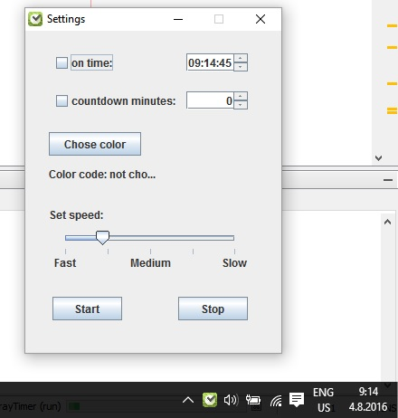
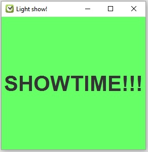
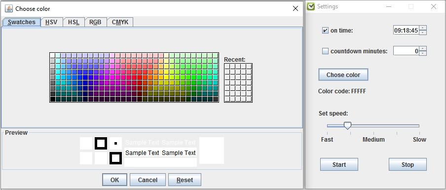

# SystemTrayTimer
This system tray application is timer that enables splash screen with a custom color and speed at exactly set time.
The code is written in Java using Swing framework.

All suggestions are welcome!
